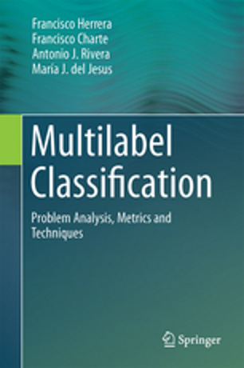

<h1>Multilabel Classification</h1> <h3>Problem analysis, metrics and techniques</h3>

by [Francisco Herrera](https://scholar.google.es/citations?hl=es&user=HULIk-QAAAAJ&view_op=list_works&sortby=pubdate), [Francisco Charte](https://scholar.google.es/citations?hl=es&user=i8l_80EAAAAJ&view_op=list_works&sortby=pubdate), [Antonio J. Rivera](https://scholar.google.es/citations?hl=es&user=VW2FhqgAAAAJ&view_op=list_works&sortby=pubdate), [María J. del Jesus](https://scholar.google.es/citations?hl=es&user=1n84M0kAAAAJ&view_op=list_works&sortby=pubdate)

[Springer](http://www.springer.com/gp/book/9783319411101), 2016.

This repository provides the multilabel datasets used throughout the chapters of the book *Multilabel Classification - Problem analysis, metrics and techniques*, as well as some code and links. Click the folder corresponding the chapters (in the list above) to download the files you are interested in. You can also clone the entire repository, as well as to download it as a ZIP file.

# About this book
This book offers a comprehensive review of multilabel techniques widely used to classify and label texts, pictures, videos and music in the Internet. A deep review of the specialized literature on the field includes the available software needed to work with this kind of data. It provides the user with the software tools needed to deal with multilabel data, as well as step by step instruction on how to use them. The main topics covered are:

+	The special characteristics of multi-labeled data and the metrics available to measure them.
+ The importance of taking advantage of label correlations to improve the results.
+ The different approaches followed to face multi-label classification.
+ The preprocessing techniques applicable to multi-label datasets.
+ The available software tools to work with multi-label data.

This book is beneficial for professionals and researchers in a variety of fields because of the wide range of potential applications for multilabel classification. Besides its multiple applications to classify different types of online information, it is also useful in many other areas, such as genomics and biology. No previous knowledge about the subject is required. The book introduces all the needed concepts to understand multilabel data characterization, treatment and evaluation.